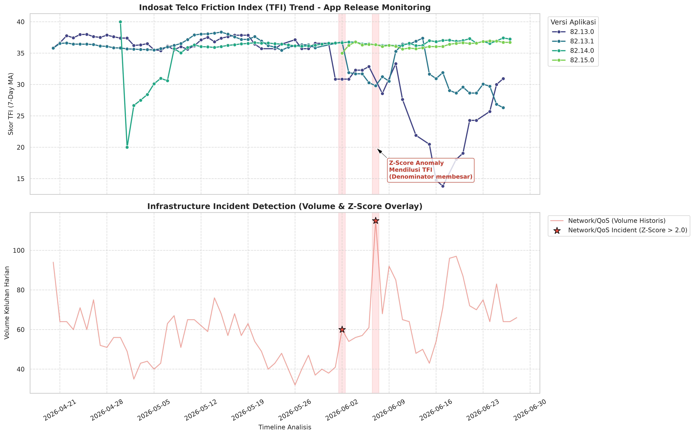
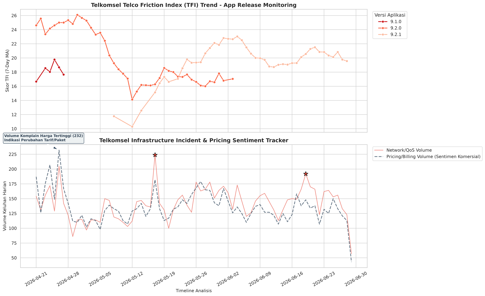

# Telco Infrastructure Stability Analysis: Indosat vs Telkomsel

Dissecting the infrastructure stability of Indonesia's two largest mobile operators using public review data from Google Play Store.

This project implements a Python-based **observability pipeline** that extracts and analyzes tens of thousands of user reviews to detect which operator is vulnerable to **network downtime** and which one frequently fails during **application deployments**.

---

## Diagnostic Methodology

The pipeline is driven by two independent diagnostic radars designed to reduce **Mean Time to Detect (MTTD)** for telco operational incidents.

### Telco Friction Index (TFI)

A ratio metric that tracks **isolated functional bugs** tied to specific application release versions. It measures the concentration of client-layer (app) failures per release.

```
TFI = (App/System Complaint Volume / Total Complaints) x 100
```

- **Purpose:** Isolate code regression failures or deployment bugs on a specific app version.
- **Bias Mitigation:** Uses Dynamic Thresholding based on Extreme Upper Quartile (95th Percentile) to eliminate Small Sample Variance from outdated app versions.

### Z-Score Operational Event Detection

Measures the magnitude of daily complaint volume spikes to detect **infrastructure-layer disruptions** (backend/network outages).

```
Z = (X - mu) / sigma
```

- **Configuration:** A 14-day rolling window is used to account for two full weekly seasonality cycles.
- **Threshold:** Z-Score > 2.0 declares a mass operational incident (Pricing or Network).

---

## Key Findings

### Case 1: Indosat (MyIM3) -- Infrastructure Vulnerability

The Z-Score algorithm captured an **extreme 3-sigma deviation** on **June 7, 2026** for the Network/QoS category, with complaint volume reaching **115 in a single day** (Z-Score: **3.08**).

The simultaneous drop in app-related complaints on the same date was a **statistical illusion** -- the TFI ratio was diluted by the explosion in network complaints inflating the denominator.

A separate functional anomaly was detected on app **version 82.15.0** on **June 23, 2026**, with a peak TFI score of **37.78**.



---

### Case 2: Telkomsel (MyTelkomsel) -- Application Release Vulnerability

A contrasting anomaly profile. The network infrastructure proved **resilient** -- no Z-Score triggers were recorded.

However, TFI detected an **extreme spike in late April**, indicating a code regression defect during that release deployment. The Pricing/Billing sentiment tracker (dashed line) also captured a peak of **>8,600 dominant complaints** related to package tariff changes.



---

## Architectural Conclusion

| Dimension | Indosat (MyIM3) | Telkomsel (MyTelkomsel) |
|---|---|---|
| **Network Infrastructure** | Vulnerable -- 3-sigma outage detected | Resilient -- no Z-Score triggers |
| **Application Stability** | Isolated regression on v82.15.0 | Systemic TFI spike on release cycle |
| **Primary Risk Surface** | BTS / Network layer | App deployment / Release pipeline |

---

## Project Structure

```text
.
├── dashboard_output/
│   ├── indosat_portfolio_dashboard.png
│   ├── indosat_portfolio_dashboard_connected.png
│   ├── telkomsel_portfolio_dashboard.png
│   └── telkomsel_portfolio_dashboard_final.png
├── dataset_indosat/
│   ├── im3_master_catalog.csv            # Package catalog from HAR network log
│   ├── im3_tfi_analysis.csv              # Daily TFI aggregation
│   ├── im3_tfi_multidimensional.csv      # TFI matrix by app version
│   ├── myim3_reviews_raw.csv             # Raw scraped reviews from Google Play
│   └── myim3_reviews_tagged.csv          # NLP-tagged complaint categories
├── dataset_telkomsel/
│   ├── telkomsel_basic_reviews_raw.csv   # Raw reviews (Telkomsel basic tier)
│   ├── telkomsel_reguler_reviews_raw.csv # Raw reviews (Telkomsel regular tier)
│   ├── tsel_reguler_reviews_tagged.csv   # NLP-tagged complaint categories
│   └── tsel_tfi_multidimensional.csv     # TFI matrix by app version
├── calculate_tfi_isat.ipynb              # Indosat analysis pipeline
├── calculate_tfi_telkom.ipynb            # Telkomsel analysis pipeline
├── nlp_processor.py                      # Reusable NLP text classification module
├── parse_har.py                          # HAR network log parser
├── scrap-gplay.ipynb                     # Google Play review scraper
└── README.md
```

## Pipeline Components

| Module | Description |
|---|---|
| `scrap-gplay.ipynb` | Scrapes user reviews from Google Play Store API |
| `nlp_processor.py` | Keyword-based NLP classifier that tags reviews into `Pricing/Billing`, `Network/QoS`, `App/System`, or `General/Other` |
| `parse_har.py` | Extracts package/offer metadata from captured HAR network traffic logs |
| `calculate_tfi_isat.ipynb` | Full analysis pipeline for Indosat: NLP tagging, TFI computation, Z-Score detection, and dashboard generation |
| `calculate_tfi_telkom.ipynb` | Full analysis pipeline for Telkomsel: same methodology applied to a different operator |

---

## Tech Stack

- **Python 3** -- Core pipeline language
- **Pandas** -- Time-series aggregation and data manipulation
- **Matplotlib** -- Dashboard visualization and anomaly overlay charts
- **NLP (keyword-based)** -- Lightweight complaint categorization without heavy ML dependencies
- **Google Play Scraper** -- Public review data extraction

---

## License

This project is provided for educational and research purposes.
